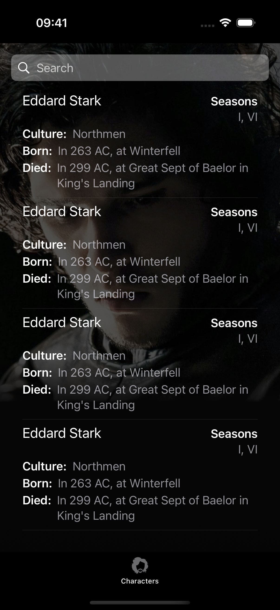
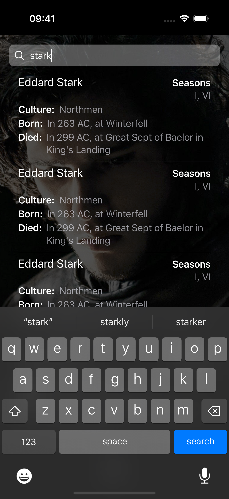

# Tech Test

You have been provided with an in-development iOS app. The application uses an
API to display lists of data about characters from the show "Game of Thrones".
The project has some bugs and notable UI mismatches compared to the given
designs.

## UIKit vs SwiftUI

Two versions of the app are provided - one built using UIKit and the other built
using SwiftUI.  These are provided in separate directories.

YOU ARE NOT EXPECTED TO TACKLE BOTH THE UIKIT AND SWIFTUI VERSIONS OF THE APP.

Please work with whichever version you feel demonstrates your skills to their
best advantage.

## Some issues that have been reported

- App crashes on launch
- Major discrepencies with the designs e.g. white padding

## Improvements required

- A new feature needs to be added that would allow a user to search the list by
  character name.

## Resources

The API endpoint is available from:
 [https://yj8ke8qonl.execute-api.eu-west-1.amazonaws.com/characters](https://yj8ke8qonl.execute-api.eu-west-1.amazonaws.com/characters)
Requests to that endpoint will require the following header:
"Authorization": "Bearer 754t!si@glcE2qmOFEcN"

Example mockups for the list view and search feature are as follows:

| Default state                         | Search state                            |
| ------------------------------------- | --------------------------------------- |
|  |  |

## Criteria on which we will assess your submission

- Closeness to designs (pragmatism is encouraged and pixel perfection is NOT
  required)
- Code quality, included but not limited to, design patterns and organisation of
  the application code
- Scalability
- Error handling
- Unit tests

## Submission details

We would like you to fix the app's user facing issues (both documented and
undocumented), add the additional search feature and submit the codebase in a
more scalable state.

You MUST use version control. Import the supplied code as is to git and commit
your changes through that. Make sure to include the git history with your
submission. This will allow us to review the changes you have made and is
essential to us checking the work is not plagiarised.

We expect you should spend no more than 3 hours on this work. We appreciate you
taking the time to work on this and understand that sometimes it's not possible
to spend as much time as you would like. If there are any aspects of the
codebase you would have liked to work on with more time, please detail these in
the ReadME file to give us some insight in to your process.
